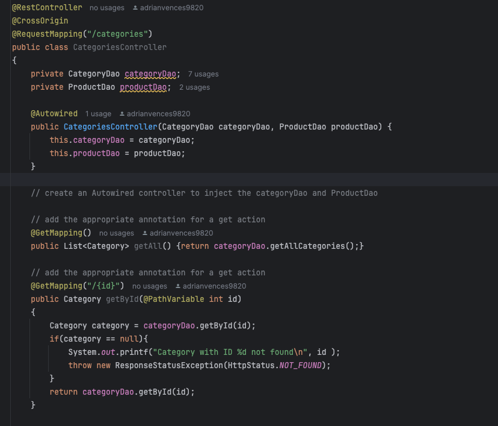
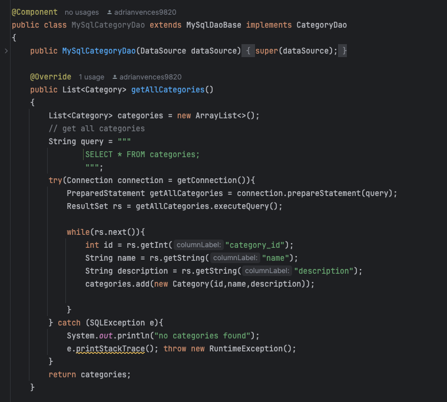
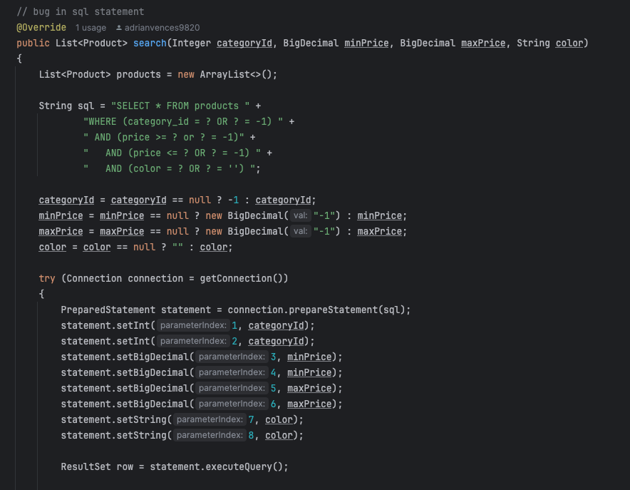
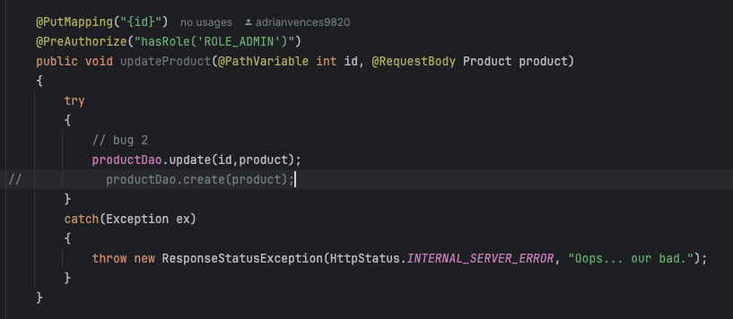

#  💻 🏪 EasyShop Capstone 🏪 💻 

This capstone is an e-commerce application for a company named easy shop.
---

## Table of Contents

- [About](#about)
- [Installation](#installation)
- [Categories Controller](#CategoriesController)
- [Categories DAO](#CategoriesDAO)
- [Bugs](#Bugs)


---

## About

For this capstone project, we were provided with starter code that was incomplete
and contained a few bugs that we needed to address. Throughout the development process,
we leveraged Postman to run a series of tests to ensure that our controllers and DAOs
were functioning correctly. These tests were essential in validating the integrity and
behavior of our application endpoints.

### Features
- MySqlCategoryDao
- CategoriesController

---

## CategoriesController
We were tasked with adding the logic and proper annotations to the controller.




---


## CategoriesDAO
We were tasked with adding the logic to the dao. The methods were already implemented for us
through the CategoriesDao interface.



---

## Bugs
### Bug 1

- In bug 1 I had to improve the MySql query
- Fix the statement set parameters 
- The issue was that the minimum and maximum price code was wrong. 

---

### Bug 2

- In bug 2 the updateProduct Method had the wrong method called for update
- It had the create method instead of the update method in updateProduct

---

## Installation

Follow these instructions to set up the project on your local machine.

1. Clone the repository:
   ```bash
   git clone https://github.com/adrianvences/easy-store-capstone
